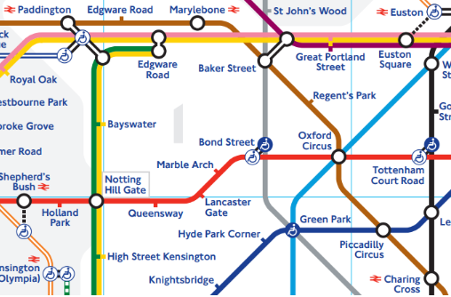

# Overtime Features Walkthrough
> This walkthrough is based on commands from [tfl_example.py](./tfl_example.py), which showcases the library's features using saved data from the Central line. The saved data is a snapshot of running trains on the Central line over a time period of around 1 hour.


> First, import the library and build a graph using some previously saved test data.
```python
import overtime as ot

central = ot.TemporalDiGraph('CentralLine', data=ot.CsvInput('./data/central-inbound.csv'))

central # TemporalDiGraph object, meaning it's edges are TemporalArcs with a direction and duration.
```

## Graph Components API

### Nodes
```python
central.nodes # Nodes object

# The number of nodes in the graph, equivalent to the number of stations on the Central line.
central.nodes.count()
>>> 36

# The labels of each node in the graph.
central.nodes.labels()
>>> ['West Ruislip', 'Bond Street', 'Leytonstone', 'Marble Arch', 'Chigwell', 'Lancaster Gate', 'Leyton', 'Queensway', 'Snaresbrook', 'Notting Hill Gate', 'Roding Valley', 'Woodford', 'South Woodford', 'Stratford', 'Holland Park', 'Mile End', "Shepherd's Bush (Central)", 'Bethnal Green', 'White City', 'Hainault', 'Liverpool Street', 'East Acton', 'Bank', 'North Acton', 'Hanger Lane', "St. Paul's", 'Perivale', 'Chancery Lane', 'Grange Hill', 'Greenford', 'Holborn', 'Northolt', 'Tottenham Court Road', 'South Ruislip', 'Oxford Circus', 'Ruislip Gardens']

# The 'Oxford Circus' node.
oxcircus = central.nodes.get('Oxford Circus') # Node object

# The labels of each neighbour of Oxford Circus on the Central line.
# You can see this from the map above, the Central line is marked in red.
oxcircus.neighbours().labels()
>>> ['Tottenham Court Road', 'Bond Street']

# Oxford Circus is the source of 4 edges in the test data, listed below.
oxcircus.sourceof().labels()
>>> ['Oxford Circus-Bond Street', 'Oxford Circus-Bond Street', 'Oxford Circus-Bond Street', 'Oxford Circus-Bond Street']

# These edges have start & end times
oxcircus.sourceof().start_times()
>>> [889, 908, 933, 949]

oxcircus.sourceof().end_times()
>>> [890, 909, 934, 950]

# Similarly, Oxford Circus is the sink of 4 edges in the test data.
oxcircus.sinkof().labels()
>>> ['Tottenham Court Road-Oxford Circus', 'Tottenham Court Road-Oxford Circus', 'Tottenham Court Road-Oxford Circus', 'Tottenham Court Road-Oxford Circus']
```

### Edges
```python
central.edges # TemporalArcs object, which is expected since Central is a TemporalDiGraph

# The number of edges in the graph, equivalent to the number of train journeys between stations on the Central line from the test data.
central.edges.count()
>>> 140

# The labels of some of the edges are shown below.
central.edges.labels()[0:10]
>>> ['Hainault-Grange Hill', 'Grange Hill-Chigwell', 'Chigwell-Roding Valley', 'Roding Valley-Woodford', 'Woodford-South Woodford', 'South Woodford-Snaresbrook', 'Snaresbrook-Leytonstone', 'Leytonstone-Leyton', 'Leyton-Stratford', 'Hainault-Grange Hill']

# Returning to Oxford Circus, we can locate it's corresponding edges.
central.edges.get_edge_by_node('Oxford Circus').labels()
>>> ['Tottenham Court Road-Oxford Circus', 'Oxford Circus-Bond Street', 'Tottenham Court Road-Oxford Circus', 'Oxford Circus-Bond Street', 'Tottenham Court Road-Oxford Circus', 'Oxford Circus-Bond Street', 'Tottenham Court Road-Oxford Circus', 'Oxford Circus-Bond Street']
```

## Graph
```python
# Retrieve some basic information about the graph.
central.details()
>>>     Graph Details:
        Label: CentralLine
        Directed: True
        Static: False
        #Nodes: 36
        #Edges: 140


```

---
